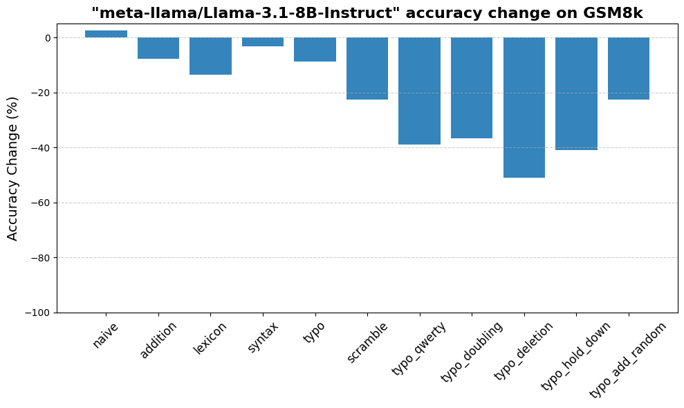

<br />
<p align="center">
<a></a>
  <h3 align="center">NoOp+</h3>
  <p align="center">
    Math Retrieval Seminar<br />
    <p align="center">
  <a href="https://github.com/Tingel24/noop-plus/blob/main/LICENSE"></a>
  <a href="https://github.com/Tingel24/noop-plus/network/members"></a>
  <a href="https://github.com/Tingel24/noop-plus/stargazers"></a>
</p>
<p>
<a href="https://github.com/Tingel24/noop-plus/issues">Report Bug</a>
·
<a href="https://github.com/Tingel24/noop-plus/issues">Request Feature</a>
</p>


A toolkit for applying various “NoOp+” (meaning “no operation” as in not changing the semantic meaning) paraphrasing methods to
popular NLP datasets. This project also provides an evaluation script to assess how well large language models (LLMs)
handle these transformed datasets.

## Table of Contents

- [Overview](#overview)
- [Key Features](#key-features)
- [Supported Datasets](#supported-datasets)
- [Paraphrase Types](#paraphrase-types)
    - [Naive Addition](#1-naive-addition)
    - [Addition](#2-addition)
    - [Lexicon Changes](#3-lexicon-changes)
    - [Syntax Changes](#4-syntax-changes)
    - [Typo Transformations](#5-typo-transformations)
    - [Scramble](#6-scramble)
- [Repository Structure](#repository-structure)
- [Usage](#usage)
- [Relevant Literature](#relevant-literature)
- [Future Work](#future-work)
- [Contributing](#contributing)

---

## Overview

`NoOp-Plus` was developed for the module **M.Inf.2248.Mp Seminar Math Information Retrieval**. The goal is to study how
different paraphrase transformations can affect language model performance on standard NLP benchmarks. By introducing
transformations such as *adding irrelevant context*, *typo modifications*, and more, this project probes the robustness
of language models under shifts that are typically inconsequential to human understanding.

---

## Key Features

- **Multiple Paraphrasing Techniques**: Includes a range of transformation methods, from minimal text scrambling to more
  involved paraphrasing.
- **Dataset-Agnostic**: While examples are shown for GSM8K, the same approach works on other datasets (MMLU, BBH, MuSR,
  etc.) with minimal modification.
- **LLM Evaluation**: A ready-made evaluation script to benchmark how well models fare on paraphrased vs. original
  datasets.
- **Easy Hugging Face Integration**: Push or pull datasets to/from Hugging Face, enabling streamlined sharing and
  versioning of transformed data.
- **Research-Oriented**: Created within an academic setting to encourage additional experimentation, extension, and
  analysis.

---

## Supported Datasets

Currently tested on (but not limited to):

- **GSM8K**
- **MMLU** (Massive Multitask Language Understanding)
- **BBH** (Big-Bench Hard)
- **MuSR**

The transformations and evaluation scripts are structured similarly for each dataset, making it easy to add new
datasets.

---

## Paraphrase Types

Below are the primary transformations included. Each transformation can be selectively applied to your dataset of
choice.

### 1. Naive Addition

- **Description**: Appends the same simple extra sentence or phrase to each question without significant prompt-based
  generation.
- **Goal**: Provides a quick method to insert irrelevant text and observe whether LLM performance changes with
  superficial “noise.”

### 2. Addition

- **Description**: Adds more sophisticated, often longer irrelevant context to questions, using prompt-based generation.
- **Goal**: Tests a model’s ability to handle extraneous or distracting material in the prompt.

### 3. Lexicon Changes

- **Description**: Substitutes key words or phrases with contextually related terms (e.g., synonyms or near-synonyms),
  guided by an LLM or model-based distribution.
- **Goal**: Evaluates how subtle shifts in wording (without altering the core meaning) impact model performance.

### 4. Syntax Changes

- **Description**: Rearranges sentence structures (e.g., reordering clauses, changing active to passive, etc.) using a
  spaCy-based approach or other NLP tools.
- **Goal**: Probes whether an LLM can parse the same meaning when sentence syntax is modified.

### 5. Typo Transformations

- **Description**: Injects typographical errors (e.g., QWERTY slip, doubling letters, random character insertion, etc.).
  Multiple specific typo types are available:
    - `typo_qwerty`
    - `typo_doubling`
    - `typo_deletion`
    - `typo_hold_down`
    - `typo_add_random`
- **Goal**: Tests model resilience against noisy or user-typed input that deviates from standard spelling.

### 6. Scramble

- **Description**: Rearranges the characters in each word of the question.
- **Goal**: Further tests the model’s ability to parse and interpret partially jumbled text.

---

## Repository Structure

```
noop-plus/
│
├── converter/
│   └── converter.py               # Core functions for text transformations
│
├── DATASET_NAME/
│   ├── DATASET_NAME-noopplus.ipynb  # Example script: load DATASET_NAME, apply transformations, upload to HF
│   └── DATASET_NAME-noopplus_evaluation.ipynb # Example script: evaluate model on the new (paraphrased) dataset
├── ...                            # Similarly structured scripts for other datasets
│
├── README.md                      # This file
├── visualisation.ipynb            # Results visualisation
└── requirements.txt               # List of Python dependencies
```

- **`gsm8k-noopplus.ipynb`**  
  Demonstrates how to load the GSM8K dataset, apply each available paraphrase transformation (addition, syntax changes,
  typos, etc.), and upload the modified dataset to Hugging Face.

- **`gsm8k-noopplus_evaluation.ipynb`**  
  Loads the original and transformed GSM8K datasets, queries a local or remote LLM (via an API), and computes accuracy
  or other metrics. The results are saved locally for later review.

---

## Usage

1. **Clone the Repository**
   ```bash
   git clone https://github.com/yourusername/noop-plus.git
   cd noop-plus
   ```

2. **Install Dependencies**  
   Make sure to install all necessary libraries:
   ```bash
   pip install -r requirements.txt
   ```
   > *Note:* Some transformations use spaCy models (e.g., `en_core_web_sm`) which may require an additional download:
   > ```bash
   > python -m spacy download en_core_web_sm
   > ```

3. **Set Up Environment Variables**
    - If you use `.env` for storing keys, ensure that you have entries like `VLLM_API_KEY` (or any relevant API keys)
      for the model queries.
    - Adjust your base URLs or endpoints in the scripts if you run a local or custom LLM server.

4. **Run the Transformation Script**  
   Navigate to the dataset folder and run the creation notebook.
   The script will:
    - Load the original dataset.
    - Apply the selected transformations (naive addition, addition, lexicon-changes, syntax-changes, typos, scramble).
    - Optionally upload the transformed dataset to your Hugging Face account (change the `repo_id` and user name as
      needed).

5. **Evaluate the Transformed Dataset**  
   Once the new dataset is created on HF, you can run the evaluation notebook of the selected dataset.
   This will:
    - Load the transformed dataset (and baseline if desired).
    - Query your specified LLM endpoint.
    - Collect answers, parse final outputs, and compute accuracy or other metrics.
    - Save results to disk (a JSON file with the accuracy values and the dataset with new columns containing the generated answers).

6. **Check Results**  
   Results of evaluations (accuracy) will be stored in a separate JSON file.
7. **Visualize Results**  
   Use `visualisation.ipynb` to plot the result

---
## Relevant Literature
1. Iman Mirzadeh, Keivan Alizadeh, Hooman Shahrokhi, Oncel Tuzel, Samy Bengio, & Mehrdad Farajtabar. (2024).
**GSM-Symbolic: Understanding the Limitations of Mathematical Reasoning in Large Language Models**.
1. Qihuang Zhong, Kang Wang, Ziyang Xu, Juhua Liu, Liang Ding, & Bo Du. (2024). 
**Achieving >97% on GSM8K: Deeply Understanding the Problems Makes LLMs Better Solvers for Math Word Problems**.
1. Freda Shi, Xinyun Chen, Kanishka Misra, Nathan Scales, David Dohan, Ed Chi, Nathanael Schärli, & Denny Zhou. (2023). 
**Large Language Models Can Be Easily Distracted by Irrelevant Context**.
1. Karl Cobbe, Vineet Kosaraju, Mohammad Bavarian, Mark Chen, Heewoo Jun, Lukasz Kaiser, Matthias Plappert, Jerry Tworek, Jacob Hilton, Reiichiro Nakano, Christopher Hesse, & John Schulman (2021). 
**Training Verifiers to Solve Math Word Problems**.
1. Dan Hendrycks, Collin Burns, Steven Basart, Andy Zou, Mantas Mazeika, Dawn Song, & Jacob Steinhardt(2020). 
**Measuring Massive Multitask Language Understanding**.
1. Zayne Sprague, Xi Ye, Kaj Bostrom, Swarat Chaudhuri, & Greg Durrett. (2024). 
**MuSR: Testing the Limits of Chain-of-thought with Multistep Soft Reasoning**.
1. Mirac Suzgun, Nathan Scales, Nathanael Schärli, Sebastian Gehrmann, Yi Tay, Hyung Won Chung, Aakanksha Chowdhery, Quoc V. Le, Ed H. Chi, Denny Zhou, & Jason Wei. (2022). 
**Challenging BIG-Bench Tasks and Whether Chain-of-Thought Can Solve Them**.

---


## Future Work

- **Additional Paraphrase Types**:
  ```
  Character Level
    Typo wordlist
    Typo qwerty
    Typo doubling
    Typo hold-down-key
    Typo deletion
    Typo add random
    Shuffle inner
    Shuffle all
    Shuffle vocals
    Shuffle adjacent
    Leetspeak
    Phonetic (STT error)
    Case
    Reversal
    OCR error
    Ascii (Half width, Unicode)
    Ascii Art
    Zero width injection
    Space injection
    Character mirroring (pq)
  Word Level
    Translation into random language
    Homophone replacement
    Word duplication
    Random word insertion
    Abbreviations
    Contractions
    Dialects (color -> colour)
  ```

- **New Datasets**: Expand beyond GSM8K, MMLU, BBH, MuSR to other tasks such as QA, summarization, and more specialized
  domains.
- **Enhanced Automation**: Streamline running transformations across many datasets in a single command or pipeline.
- **Deeper Robustness Metrics**: Incorporate more nuanced metrics (beyond simple accuracy) to capture partial
  correctness or reasoning quality.

---

## Contributing

Contributions are welcome! If you’ve discovered additional paraphrase techniques, want to add new datasets, or improve
the codebase, feel free to open a pull request or file an issue:

1. Fork the repository on GitHub.
2. Create a feature branch (`git checkout -b feature/AmazingFeature`).
3. Commit your changes (`git commit -m 'Add some AmazingFeature'`).
4. Push to the branch (`git push origin feature/AmazingFeature`).
5. Open a pull request.

---